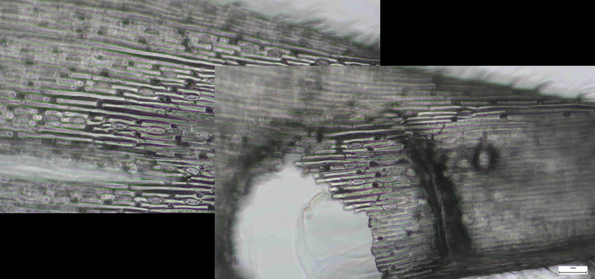
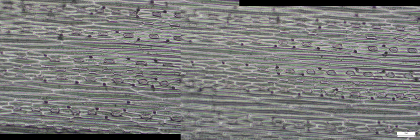

Multifocal Image Stitching
---------------
| **Documentation** | **Build Status** |
|:-----------------:|:----------------:|
| [![][docs-latest-img]][docs-latest-url] | [![Build Status][build-img]][build-url] |





### Installation

To install from [pypi](https://pypi.org/project/multifocal-stitching/):

```
pip install multifocal-stitching
```

### Usage
Ensure the images to be stitched are sequentially named in `dir`.

```
python -m multifocal_stitching -h
usage: __main__.py [-h] [-v] [--ext EXT] [--imgs IMGS [IMGS ...]] [--no_merge] [--workers WORKERS]
                   [--min_overlap MIN_OVERLAP] [--early_term_thresh EARLY_TERM_THRESH]
                   [--use_wins USE_WINS [USE_WINS ...]] [--peak_cutoff_std PEAK_CUTOFF_STD]
                   [--peaks_dist_threshold PEAKS_DIST_THRESHOLD]
                   [--filter_radii FILTER_RADII [FILTER_RADII ...]]
                   [--stitching_result STITCHING_RESULT] [--result_dir RESULT_DIR]
                   [--resize_factor RESIZE_FACTOR] [--save_gif]
                   dir

positional arguments:
  dir                   Base directory

options:
  -h, --help            show this help message and exit
  -v, --verbose         Increase output verbosity (default: False)
  --ext EXT             Filename extension of images (default: .jpg)
  --imgs IMGS [IMGS ...]
                        Stitch only provided images in provided order, otherwise will run in batch
                        mode over all images in directory (default: None)
  --no_merge            Disable generating merged images (default: False)
  --workers WORKERS     Number of CPU threads to use in FFT (default: 2)
  --min_overlap MIN_OVERLAP
                        Set lower limit for overlapping region as a fraction of total image area
                        (default: 0.125)
  --early_term_thresh EARLY_TERM_THRESH
                        Stop searching when correlation is above this value (default: 0.7)
  --use_wins USE_WINS [USE_WINS ...]
                        Whether to try using Hanning window (default: (0,))
  --peak_cutoff_std PEAK_CUTOFF_STD
                        Number of standard deviations below max value to use for peak finding
                        (default: 1)
  --peaks_dist_threshold PEAKS_DIST_THRESHOLD
                        Distance to consider as part of same cluster when finding peak centroid
                        (default: 25)
  --filter_radii FILTER_RADII [FILTER_RADII ...]
                        Low-pass filter radii to try, smaller matches coarser/out-of-focus features
                        (default: (100, 50, 20))
  --stitching_result STITCHING_RESULT
                        Stitching result csv file (default: stitching_result.csv)
  --result_dir RESULT_DIR
                        Directory to save merged files (default: merged)
  --resize_factor RESIZE_FACTOR
                        Whether to resize the images saved by a factor (default: 1)
  --save_gif            Whether to save a gif alternating between the merged files (default: False)
```

### Examples

[docs-latest-img]: https://img.shields.io/badge/docs-latest-blue.svg
[docs-latest-url]: https://github.com/yuanchenyang/multifocal-stitching
[build-img]: https://github.com/yuanchenyang/multifocal-stitching/workflows/CI/badge.svg?branch=master
[build-url]: https://github.com/yuanchenyang/multifocal-stitching/actions?query=workflow%3ACI
